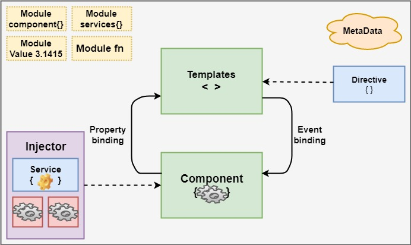

# Tp Architecture
Developing a web application for the EVAX platform (<i>Coronavirus Vaccinaction</i>).<br/>
This project was generated with [Angular CLI](https://github.com/angular/angular-cli) version 11.2.8.
## Architecture choice
Angular follows a component oriented architecture, it implements a lot of the concepts of MVVM (<i>Model View ViewModel</i>).
<br/><br/>
<br/><br/>

This architecture offers several advantages :
 <ul>
 <li><b>Two-Way Data Binding :</b> is the time-saving feature that automates some processes in our application</li>
 <Li><b>Readable and Testable Code :</b>  makes application's code logical, consistent, and easy to follow</Li>
 <Li><b>Efficient Problem-Solving Patterns :</b> offers powerful DI (<i>Dependency Injection</i>) instrument and services to resolve various productivity issues and speed up the development process</Li>
 </ul>

## Use cases implemented 
 <ol>
 <li><b>Register To get an appointment :</b> <br/>
 
   * Register to the platform 
  
   
   
   * Get the Identifier Number 
   
   

 </li>
 <li><b>Consult citizen profile : </b><br/>
 
   * Personal information
   
    
       
   * Date for vaccine appointment
   * Vaccination certificate
   * Vaccination pass    
   
   
 </li>
 </ol>
 
 ## Build
 ```
 $ git clone https://github.com/chaimabg/Architecture-Tp.git
 $ cd Architecture-Tp
 $ npm install
 ```
## Development server
Run `ng serve` for a dev server. Navigate to `http://localhost:4200/`. The app will automatically reload if you change any of the source files.

